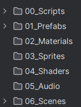

# UrFU DPO 25 - Unity Vampire Survivals like game

## Требования для Editor:

- Unity 6000.0.37f1
- WebGL Build Support module

## Структура папок

## Описание основных классов:

- Bootstrap - главный скрипт, инициализирующий игру до загрузки первой сцены
- UIRoot - главный скрипт для управления UI игры
- SceneController - скрипт переключения между сценами с экраном загрузки
- Events - статический класс, с помощью которого можно подписываться на события и тригерить их (паттерн EventBus)
- SceneNames - статический класс с константами названий сцен

## Библиотеки:

- _UniRX_ - Плагин, реализующий реактивное программирование . (Если не знаете, что это, то поищите информацию про паттерн Observer)
- _DOTween_ - Плагин для плавных изменений переменных и процедурных анимаций

## FAQ:

### Что нужно сделать при создании новой сцены?

1. Добавить объект со скриптом, унаследованным от SceneEntryPoint
2. Добавить на скрипт префаб интерфейса сцены
3. Добавить сцену в список сцен `(File -> Build Profiles -> Scene List)`
4. Добавить название сцены в список констант `(Scripts -> Constants -> SceneNames)`
